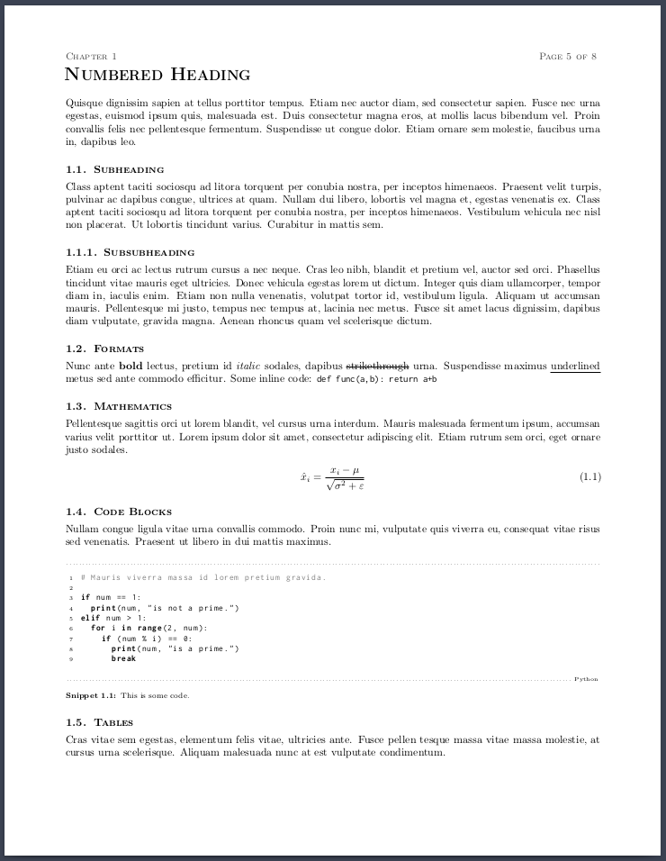
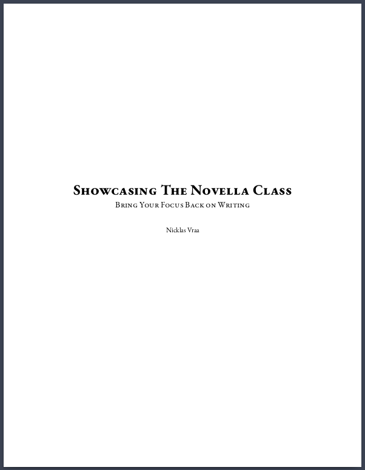
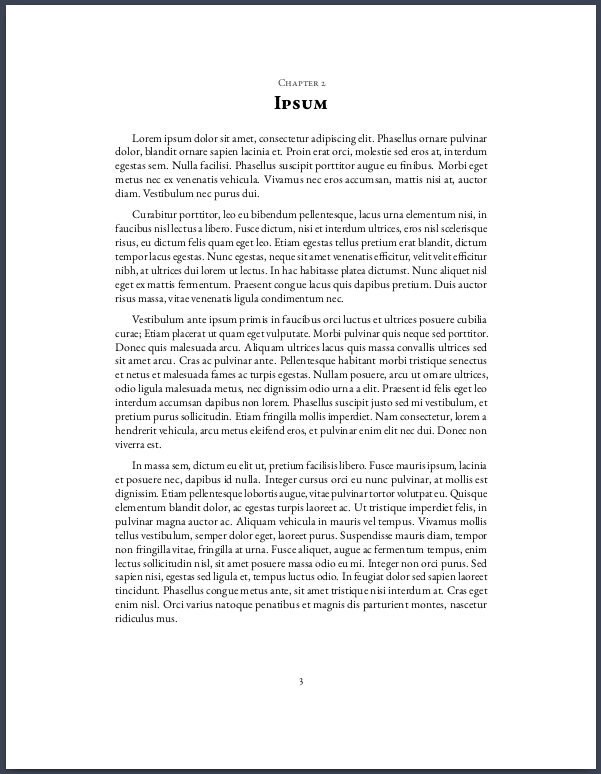
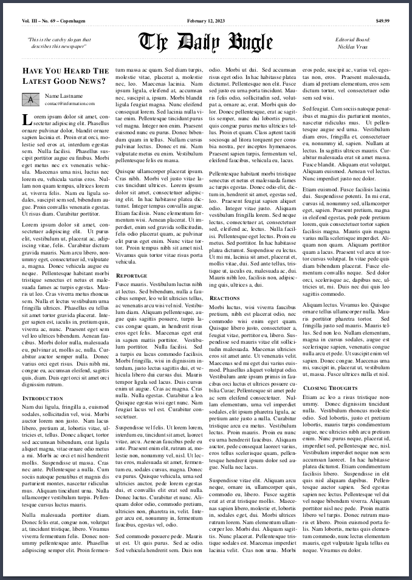
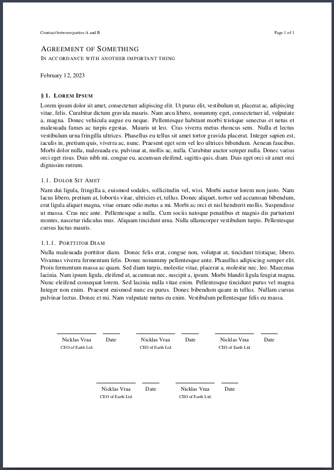
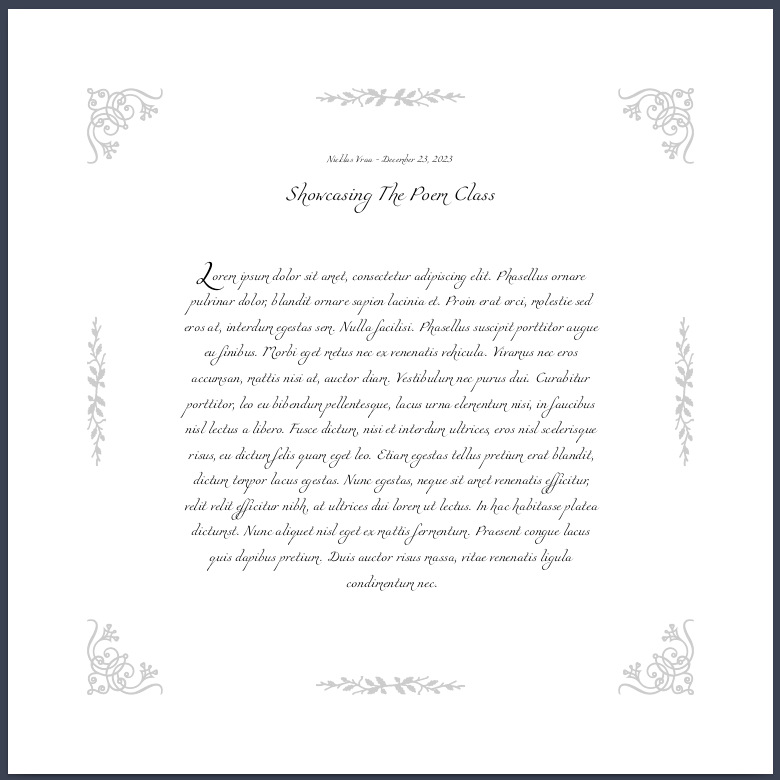

# LiX <!-- omit in toc -->

Check out LiX templates on [Overleaf](https://www.overleaf.com/latex/templates?q=lix). Replace `lix.sty` in your overleaf project with the latest one from here to apply updates. The same goes for document classes.

[Lix](lix.sty) is a meta-package which bundles other LaTeX packages and commands. To use these bundles, simply specify them when importing the LiX package, either in your own document-class, or directly in your main document when using a predefined class. The goal of this package is to speed up writing your documents, but also to simplify the process of defining your own class. Separation of layout and content is made much easier.

> LiX aims to be for LaTeX, what LaTeX is for TeX.

Disclaimer: This project breaks conventions and practices, which are considered to be "standard" by the LaTeX community. If you want to learn "pure" LaTeX, this is not the project for you. However, for those of you that want to get stuff done as painlessly as possible: enjoy.

Shortcuts: [Examples](#examples) | [Syntax](#syntax) | [Installation](#installation) | [Scripts](#scripts) | [Plans](#plans)

**Motivation**: \
While LaTeX is the indisputable king for typesetting publishable documents, it does have a steep learning curve and is very syntax-heavy. To ease the burden of typesetting and bring the author's focus back on their content, the syntax should be as light as possible. Defining your own look-and-feel is even more inaccessible, if one is not familiar with basic programming -  hence this humble project, which attempts to address these issues.

<details><summary><b>Code Example</b></summary>
Say, we want to setup a book with the US letter size and a very specific margin, It should have both front and back cover art with a title, a subtitle, multiple authors, etc, which should be added to the pdf-metadata. We would also like a page containing formal information, such as licensing and an ISBN-code and maybe a barcode. We want to be able to include centered, scaled figures and syntax-highlighted code blocks, both captioned. We would also like the document to be in Danish, following specific hyphenation rules, etc.

All that can be achieved by this:
```latex
\documentclass{book}
\usepackage[stdclass, all]{lix}

\lang      {danish}
\size      {letter}
\cover     {path/to/front.pdf}{path/to/back.pdf}
\margins   {22mm}{20mm}{21mm}{40mm}
\title     {A Cool Title}
\subtitle  {And a Cool Subtitle}
\authors   {Nicklas Vraa}{Another Guy}{And Another}
\date      {01/01/2023}
\isbn      {123456789}
\license   {CC}{nc}{3.0}{My Company}
\edition   {3}{2023}
\watermark {DRAFT}{black!10}

\begin{document}
% ... No need for \maketitle

\h{Introduction}
% ...

    \code{my_snippet}{python}{
    import numpy as np
    % ...
    }{This code does this and that...}

% ...

    \fig{ny_figure}{0.8}{path/to/image.png}{This figures explains how...}

% ...

\end{document}
```
Imagine the LaTeX code, you would have to write to achieve the same - even when using appropriate packages. The layout of each element should be customized by defining a custom class that builds on top of one of the standard classes. Examples are shown later.

</details>

<details><summary><b>Advantages and Disadvantages</b></summary>

Advantages:
- The source code of a document becomes as easy to read and understand as Markdown and is drastically shorter.
- The style of a document is completely separated from its content, and keeping a consistent style is simpler.
- Configuring your document is simpler, because you don't interface directly with individual packages, which may employ different syntax.
- Creating your own class, which implements a custom look-and-feel, is much easier.

Disadvantages:
- If one wants to change their document into a class that has not been defined using this package, there may be difficulties when compiling. To address this, I've recreated the `IEEEtran` class, as a reference for how to reimplement an existing look using LiX.
- You do not have the extreme fine-grained control over your custom class, as you would with pure LaTeX.
- The command names are not as descriptive as standard LaTeX. Minimal impact on source-code readability was prioritized.

</details>

---
## 1. Class Examples <a name="examples"></a>
Using this package, I've defined some custom classes, which are ready for use, as well as classes which mimic popular formats. Look at the source code for each class to see how easily they were defined. It's very simple to convert to another class, as they all share the exact same syntax. Download the pdf's to see the actual quality.
|  |   |   |   |   |   |
| ----- | - | - | - | - | - |
| [Paper](classes/custom_classes/paper.cls) ([tex](classes/custom_classes/paper_example.tex)\|[pdf](classes/custom_classes/paper_example.pdf)) packs as much information as possible, while adhering to the standards of academic research papers. |  |  |
| [Novel](classes/custom_classes/novel.cls) ([tex](classes/custom_classes/novel_example.tex)\|[pdf](classes/custom_classes/novel_example.pdf)) is meant for fiction with the intent to print. This class supplies cover-, title- and metadata pages, etc. |  |  |  |  |  |
| [Textbook](classes/custom_classes/textbook.cls) ([tex](classes/custom_classes/textbook_example.tex)\|[pdf](classes/custom_classes/textbook_example.pdf)) is intended for typesetting a large amount of academic content to be printed in book form. |  |  |  |  |  |
| [Novella](classes/custom_classes/novella.cls) ([tex](classes/custom_classes/novella_example.tex)\|[pdf](classes/custom_classes/novella_example.pdf)) is meant for short-stories with the intent to print. |  |  |  |
| [News](classes/custom_classes/news.cls) ([tex](classes/custom_classes/news_example.tex)\|[pdf](classes/custom_classes/news_example.pdf)) is designed as a classic newspaper akin to the The New York Times. |  |  |
| [IEEE](classes/popular_classes/ieee.cls) ([tex](classes/popular_classes/ieee_example.tex)\|[pdf](classes/popular_classes/ieee_example.pdf)) implements the IEEE journal and transactions template, but using LiX. |  |  |
| [Contract](classes/custom_classes/contract.cls) ([tex](classes/custom_classes/contract_example.tex)\|[pdf](classes/custom_classes/contract_example.pdf)) is a simple template for a formal contract between an arbitrary number of parties. |  |
| [Poem](classes/custom_classes/poem.cls) ([tex](classes/custom_classes/poem_example.tex)\|[pdf](classes/custom_classes/poem_example.pdf)) is a poem template that features a softer font and can optionally be decorated. |  |


Also check out:
- [Thesis](classes/custom_classes/thesis.cls) ([tex](classes/custom_classes/thesis_example.tex)\|[pdf](classes/custom_classes/thesis_example.pdf)), which is a mix between the paper and textbook classes, meant for longer academic works.


It is also possible to use the standard classes, like [article](classes/standard_classes/article_example.tex), [report](classes/standard_classes/report_example.tex) and [book](classes/standard_classes/book_example.tex), but still benefits from simplified syntax. Simply import the package and specify the `stdclass` option, along with any bundles, e.g.:
```latex
\documentclass{article}
\usepackage[stdclass, ...]{lix}
```

---
## 2. LiX Syntax <a name="syntax"></a>
This is an overview of the commands, which are available when specifying a certain bundle (in alphabetical order). To those unfamiliar with LaTeX, a command is always prefixed with a backslash `\`, mandatory input is enclosed in `{}` and optional input is enclosed in `[]`. Whitespace between a command and its input does not matter. Comments are always prefixed with a percentage symbol `%`. In-class commands are not supposed to be used in the main `.tex` document, but rather in your `.cls` file.

**Bundles**: \
[algorithms](#algorithms-), [basics](#basics-), [code](#code-), [cover](#cover-), [figures](#figures-), [formatting](#formatting-), [header](#header-), [heading](#heading-), [license](#license-), [isbn](#isbn-), [lists](#lists-), [math](#math-), [metadata](#metadata-), [periodical](#periodical-), [publish](#publish-), [ornaments](#ornaments-), [refs](#refs-), [sign](#sign-), [size](#size-), [tables](#tables-).

<details><summary><b>Algorithms</b></summary><a name="algorithms"></a>

Insert algorithms into your document. Simply type your algorithm in plain text and mix in math typesetting whenever you require, between `$`-signs. No need for any escaped `\keywords`.
```latex
...
    \algo{label}{
    % Your algorithm.
    % $some+math$
    }{caption}
...
```
Algorithms will be subtly highlighted. A label is mandatory, but caption is optional. Indent the block four spaces, as these will be gobbled (removed) in the resulting pdf. This is for better readability in the source file. I recommend indenting all algorithms, tables, figures, etc., to better distinguish them from regular text.

</details>

### Basics <a name="basics"></a>
A collection of essential commands and aliases.

- `\abstract{summary of findings}` \
  Alias: \blurb{...} (for books).
- `\add{path/to/file.tex/pdf}` \
  Inserts the tex-code from the given file, exactly like `\input{}`, but also handles pdf files, which are inserted as pages. If starred, i.e. `add*{}`, the given pdf will become the background of the current page.
- `anchor{position}{...}` \
  Aligns its content either `left`, `right` or `center`.
- `\authors{first}{second}{...}{sixth}` \
  Handles six entries. Alias: \author{...}.
- `\by{name}{email}{path/to/image.png}` \
  Byline, image is optional.
- `\date{01/01/2023}` \
  The command \today is available.
- `\idnum{123456789}` \
  Could be any alphanumeric.
- `\keywords{this, that, ...}` \
  Alias: \subjects {this, that, ...}.
- `\lang{language}{cus-tom, hyphena-tion, rules}` \
  Localizes text and sets hyphenation rules. Custom list is optional.
- `\subtitle{Some Buzzwords}` \
  Alias: \slogan{...}.
- `\title{A Catchy Title}` \
  Alias: \publication {...}.
- `\toc` \
  Generate table of contents.
- `\url{text}{link}` \
  E.g. {label}{actual url}
- `\cols{n}{...}` \
  Horizontally align content. \
  Use `\begin{columns}{n} ... \end{columns}` if `\cols` doesn't work. \
- `\watermark{Text}{color!opacity}` \
  Add text-based watermark, e.g. `DRAFT`, or `CONFIDENTIAL` with an optionally specified color and opacity, e.g. `blue!100`. Defaults to `gray!50`, if not specified.
- `\shield{Text}{opacity}` \
  Overlays every page with an invisible wall of text to prevent easy extraction of text, i.e. copy-pasting. Opacity is optional and between 0 (invisible) and 1 (black). E.g. `\shield{COPYRIGHTED, NICE TRY}`.
- `\np` and `\bl` \
  The first is an alias for `\newpage` and the second forces a blank line.

In-class commands:
- `\authorfont{\...}` \
  Apply styling commands to the author text.
- `\use{pkg1, pkg2, ..., pkgN}` \
  Import packages. Simpler alias of \usepackage.
- `\wrap{prepend...}{append...}` \
  Insert code immediately after \begin{document} and (optionally) immediately before \end{document}.


### Code <a name="code"></a>
Insert internal code blocks into your document.
```latex
...
    \code{label}{language}{
    % Your code.
    }{caption}
...
```
Or import external code from a file using the starred version.
```latex
\code*{label}{language}{path/to/file}{caption}
```

Code-blocks will be subtly highlighted according to the given language. A label is mandatory, but caption is optional. For no highlighting, set the language to `text`. For internal code block, indent the block four spaces, as these will be gobbled (removed) in the resulting pdf. This is for better readability in the source file. I recommend indenting all code-blocks, tables, figures, etc., to better distinguish them from regular text.

### Cover <a name="cover"></a>
Add a cover to your document, as in the front and back of a book.
- `\cover{path/to/front.pdf}{path/to/back.pdf}` \
  The images have to be pdf-files. The starred version will **not** print the title, author, etc. on top of the cover. This is useful, if the cover already includes these. Should be called before `\begin{document}`.

In-class commands:
- `\addFrontCover`
- `\addBackCover`


### Figures <a name="figures"></a>
Place figures, i.e. images and illustrations in your document.
- `\fig{label}{scale}{path}{caption}` \
  Places your figure at the spot where it's called, if possible. The command is file-format agnostic i.e. it works the same for both regular images and vector graphics. Scale is from 1% to 100% of the current column-width, i.e. from 0.01 to 1. Caption is optional.

### Formatting <a name="formatting"></a>
These command names were chosen to ensure that the readability of the source code is minimally affected.
- `\b{...}` (b)old text.
- `\c{...}` (c)ode/mono inline.
- `\i{...}` (i)talic text.
- `\l{...}` (l)arge letter.
- `\m{...}` (m)ath inline.
- `\s{...}` (s)trikeout.
- `\u{...}` (u)nderline.

### Header <a name="header"></a>
Add a strip of text to the top of each page.
- `\header{left}{center}{right}`

### Heading <a name="heading"></a>
Add headings to the document.
- `\h{...}` Level one heading.
- `\hh{...}` Level two heading.
- `\hhh{...}` Level three heading.
- `\hhhh{...}` Level four heading.

Top-level headings will act like chapters in book-like classes, but as sections in article-like classes. Headings will be numbered, unless a `*` is added to the command, e.g. `\h*{...}`. The regular commands, like `\chapter` and `\section` can still be used along with their starred counterparts.

- `\start{odd/even}` \
  Applicable to book-like classes only. It will instruct the compiler to add blank pages such that chapters always start on odd or even pages. In western bookbinding, it is traditional to have chapters start on odd (recto) pages. If this command is not used, no blank pages will be added.

In-class commands:
- `addheadingseparator{type}` will separate numbering from the actual heading with either a `line` or a final `dot` after the number.

### ISBN <a name="isbn"></a>
Add an ISBN-code along with a corresponding barcode to your document. Should be called before `\begin{document}`.
- `\isbn{978-0201529838}`

### License <a name="license"></a>
Add a license to your document with an automatically generated copyright statement based on the input to the command. Should be called before `\begin{document}`.
- `\license{type}{modifiers}{version}{holder}` \
  An overview of the possible inputs the command. E.g \license{CC}{by-nc-sa}{3.0}. \
  The Copyright holder is optional.
  | Types | Modifiers | Versions |
  |-------|-----------|----------|
  | Creative Commons: `CC` | Attribution: `by` <br> ShareAlike: `sa` <br> NoDerivatives: `nd` <br> NonCommercial: `nc` <br> | Universal: `1.0` <br> Unported: `3.0` <br> International: `4.0` |

### Lists <a name="lists"></a>
Add lists to your document. It is possible to nest lists.
```latex
\items{
    \item Something
    \item Another thing.
    \items*{
        \item Something else
        \item The final thing.
    }
}
```
`items{...}` will be numbered, and `items*{...}` will be bullet points.

### Math <a name="math"></a>
Add math-blocks to your document.
```latex
\math{label}{
    % Regular latex math.
}
```
The label is required and the math block will be numbered. These are shortcut commands in the math environment:
- `\mean{x}` $\rightarrow \overline{x}$
- `\Re` $\rightarrow \mathbb{R}$ (Real set)
- `\Im` $\rightarrow \mathbb{I}$ (Imaginary set)
- `\N` $\rightarrow \mathbb{N}$ (Natural set)
- `\Z` $\rightarrow \mathbb{Z}$ (Integer set)
- `\Q` $\rightarrow \mathbb{Q}$ (Rational set)
- `\C` $\rightarrow \mathbb{C}$ (Complex set)
- `\epsilon` $\rightarrow \varepsilon$ (varepsilon)

### Metadata <a name="metadata"></a>
If this bundle is loaded, it will automatically fill in the metadata fields of the pdf, like the title, subject, keywords etc.

### Periodical <a name="periodical"></a>
Add various elements relating to documents that are periodicals, like a newspaper. Should be called before `\begin{document}`.

- `\cost{\$9.99}` \
  Add a price tag.
- `\issue{123}` \
  Add in issue number.
- `\location{Copenhagen}` \
  Add a location specifier.
- `\volume{123}` \
  Add a volume number.

### Publish <a name="publish"></a>
Add various elements relating to documents that are published in book-form, like a novel. Should be called before `\begin{document}`.

- `\dedicate{dedicatee}{message}` \
  Dedicate your document to someone, along with an optional message.
- `\edition{123}{year}` \
  Specify the edition of the document and the year it was published.
- `\note{longer author's note}` \
  Add an author's note.
- `\publisher{your publishing company}` \
  Specify the publisher of your document.
- `\thank{people or organizations}` \
  Thank someone in your document.
- `\epigraph{poem or quotation}` \
  Add a short paragraph of informal text that suggests the theme of the book.
- `\endpages{N}{M}` \
  Add N blank pages to the start and optionally M blank pages to the end of the document. This is mostly useful when printing and binding the document into a book.

In-class commands (for creating custom classes): `\addFrontCover`, `\addBackCover`, `\addFormalPage`, `\addCorners`, `\addBorders`, `\addEpigraph`, `\addBlanks`.

### Ornaments <a name="ornaments"></a>
Add ornamental elements all pages of the document. Browse the types of ornaments are available in the documentation for the `pgfornaments` package. Check out the [poem](classes/custom_classes/poem_example.pdf) class for a visual example.
- `\corners{ornament_id}{color!opacity}{width}{padding}` \
  Add ornaments to all four corners of all pages. Only the ID is mandatory.
- `\borders{ornament_id}{color!opacity}{width}{padding}` \
  Add ornaments to all four sides of all pages. Only the ID is mandatory.

### Refs <a name="refs"></a>
Reference internal elements and cite external sources from your bibliography.
- `\at{label}` \
  Reference your figures, tables, math-blocks, headings, code-blocks, etc. using your own labels.
- `\At{label}` \
  Uppercase equivalent of \r.
- `\cite{your_source}` \
  As defined in your bibliography file.
- `\bib{path/to/refs}{style}` \
  Specify and print your bibliography in a given style. \
  Styles: `abbrv`, `acm`, `alpha`, `apalike`, `ieeetr`, `plain`, `siam`, `unsrt` \
  Default to `unsrt` (in order of appearance). \
  Do not include the `.bib` extension when specifying the path. \
  Adding a `*` to the command, i.e. `\bib*{...}` will print the entire given bibliography, regardless of whether entries have been explicitly referenced in your document.

In-class commands:
- `\bibfont{\...}` \
  Apply styling commands to the bibliography text.

### Sign <a name="signature"></a>
Place signature fields in your document.
- `sign{name}{designation}` \
  E.g. \sign{Nicklas Vraa}{CEO of the Universe}. To place multiple fields on the same line, don't leave a blank line between command calls.

### Size <a name="size"></a>
These are commands for setting up the basic layout characteristics of your document. Should be called before `\begin{document}`.
- `\size{standard}{orientation}` \
  Set the dimensions and orientation of your document by specifying standards. E.g \size{a4}{portrait}.
  | ISO-A | ISO-B | ISO-C | ANSI | US | Orientation |
  |-------|-------|-------|------|----|-------------|
  | `a0` <br> `a1` <br> ... <br> `a6` | `b0` <br> `b1` <br> ... <br> `b6` | `c0` <br> `c1` <br> ... <br> `c6` | `ansia` <br> `ansib` <br> ... <br> `ansie` | `letter` <br> `executive` <br> `legal` | `portrait` <br> `landscape` |

  Alternatively, use `\size{custom}{width}{height}`, e.g. `\size{custom}{6in}{9in}`.
- `\margins{top}{bot}{inner}{outer}` \
  Alternatively, the margins may be specified as `{all}`, `{topbot}{innerouter}`, `{top}{bot}{innerouter}`. When doing double-sided printing, the inner margin is often wider than the outer margin to allow for space to bind pages together. For single-sided printing and digital-only documents, the inner and outer margins are almost always equal.

### Tables <a name="tables"></a>
There are three types. These three tables will cover 90% of your table-needs, but you have access to the full power of the tabularray package for more complicated tables. The `&` symbol separates items and `\\` separates rows. Caption is optional.
```latex
\tabs{label}{type}{
    % Your table content.
}{caption}
```
Types:
- `cols`: Classic table, the top row acts as the header.
- `rows`: The left-most column acts as the header.
- `grid`: Both the top row and left-most column act as headers.

Formatting code for the table may also be given explicitly in the type field.


---
## 3. Installation <a name="installation"></a>
The LiX package and all classes work out-of-the-box with [Overleaf](https://www.overleaf.com). Simply include `lix.sty` and the appropriate `.cls` file in your project folder.

If you are working locally, you need to have all package dependencies installed. Depending on which bundles are imported and what class is in use, LiX may import the following packages:

> [amsfonts](https://ctan.org/pkg/amsfonts), [amsmath](https://ctan.org/pkg/amsmath), [amssymb](https://ctan.org/pkg/amsfonts), [babel](https://ctan.org/pkg/babel), [caption](https://ctan.org/pkg/caption), [cite](https://ctan.org/pkg/cite), [doclicense](https://ctan.org/pkg/doclicense), [ebgaramond](https://ctan.org/pkg/ebgaramond), [enumitem](https://ctan.org/pkg/enumitem), [esint](https://ctan.org/pkg/esint), [eso-pic](https://ctan.org/pkg/eso-pic),, [fancyhdr](https://ctan.org/pkg/fancyhdr), [float](https://ctan.org/pkg/float), [fontenc](https://ctan.org/pkg/fontenc), [geometry](https://ctan.org/pkg/geometry), [gothic](https://ctan.org/pkg/gothic), [graphicx](https://ctan.org/pkg/graphics), [GS1](https://ctan.org/pkg/gs1), [hyperref](https://ctan.org/pkg/hyperref), [inconsolata](https://ctan.org/pkg/inconsolata), [inputenc](https://ctan.org/pkg/inputenc), [lastpage](https://ctan.org/pkg/lastpage), [lettrine](https://ctan.org/pkg/lettrine), [lipsum](https://ctan.org/pkg/lipsum), [listings](https://ctan.org/pkg/listings), [microtype](https://ctan.org/pkg/microtype), [multicol](https://ctan.org/pkg/multicol), [numspell](https://ctan.org/pkg/numspell), [parskip](https://ctan.org/pkg/parskip), [pgfornaments](https://ctan.org/pkg/pgfornament), [setspace](https://ctan.org/pkg/setspace), [silence](https://ctan.org/pkg/silence), [siunitx](https://ctan.org/pkg/siunitx), [svg](https://ctan.org/pkg/svg), [tabularray](https://ctan.org/pkg/tabularray), [titlesec](https://ctan.org/pkg/titlesec), [titletoc](https://ctan.org/pkg/titletoc), [titling](https://ctan.org/pkg/titling), [tocbibind](https://ctan.org/pkg/tocbibind), [ulem](https://ctan.org/pkg/ulem), [xcolor](https://ctan.org/pkg/xcolor), [xparse](https://ctan.org/pkg/xparse), [yfonts](https://ctan.org/pkg/yfonts)

Check up on the [svg](https://ctan.org/pkg/svg?lang=en) package, which has non-latex dependencies. If you have svg's included in your document, the compiler has to be run with the argument: `--shell-escape`.

For VSCode, I recommend installing the [LaTeX Workshop](https://github.com/James-Yu/LaTeX-Workshop) extension, and adding this [snippet file](additional/lix.code-snippets) to your snippets collection, and this [entry](additional/settings.json) to your own `settings.json` file.

---
## Scripts <a name="scripts"></a>
The following are bash commands that call scripts which are particularly useful for self-publishing and book production.

Encrypt and protect your PDF with a user- and owner-password for more secure distribution. Supply passwords and paths to source and destination. Requires `qpdf`.
```bash
qpdf --encrypt <userpass> <ownerpass> 256 --modify=none --extract=n --print=none -- <source>.pdf <dest>.pdf
```

Prepare your PDF for book-style printing by performing automatic imposition. Supply the number of pages per signature `N`, the sheet dimensions, and paths to source and destination. Requires `pdfjam`.
```bash
pdfjam --nup 2x1 --signature <N> --frame false --twoside --trim '0cm 0cm 0cm 0cm' --clip true --quiet --keepinfo --papersize '{<height>,<2*width>}' --tidy --landscape --longedge --outfile <dest>.pdf <source>.pdf
```

---
## 5. Plans <a name="plans"></a>
LiX package:
- [x] Watermark command.
- [x] Add ornamental commands.
- [ ] Debug `\authors` command to ensure proper formatting of multiline input.
- [ ] Further simplify table syntax. Use `|` instead of `&`.
- [ ] Add more types of tables to `\tabs`.
- [ ] Add optional argument to `\toc` for specifying sorting order.
- [ ] Revision command.

Classes:
- [x] Research Paper
- [x] Textbook
- [x] Formal Contract
- [x] Newspaper
- [x] Novel
- [x] Novella
- [x] IEEE Journal/transactions
- [x] Modern IEEE Research Paper
- [x] Thesis
- [x] Poem
- [ ] Presentation
- [ ] Handin

Additional:
- [ ] Syntax highlighter for VSCode using a grammar injection.

---
**LEGAL NOTICE**: This repository, including any and all of its forks and derivatives, may NOT be used in the development or training of any machine learning model of any kind, without the explicit permission of the owner of the original repository.
